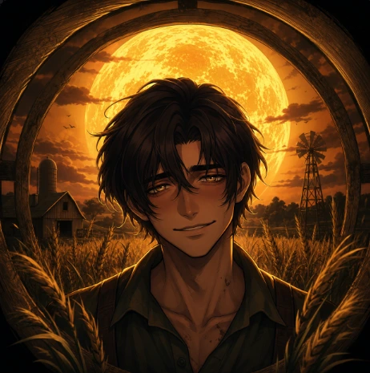
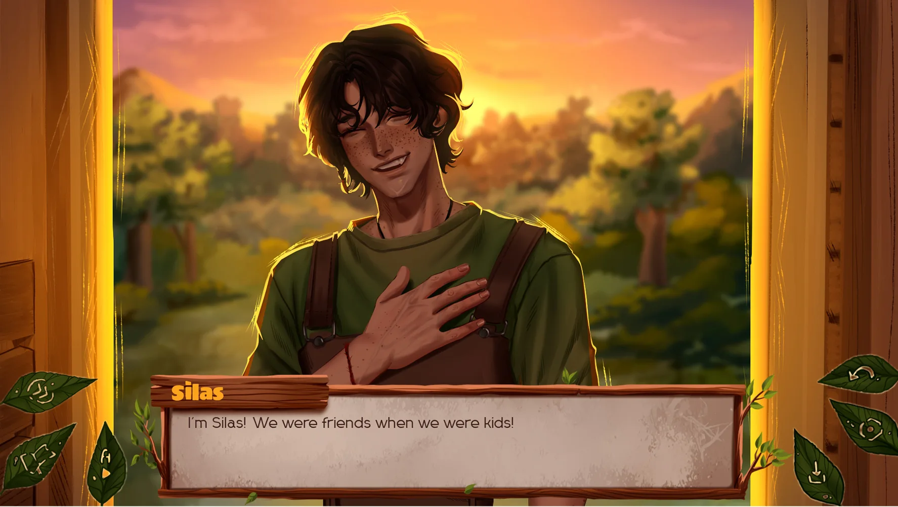
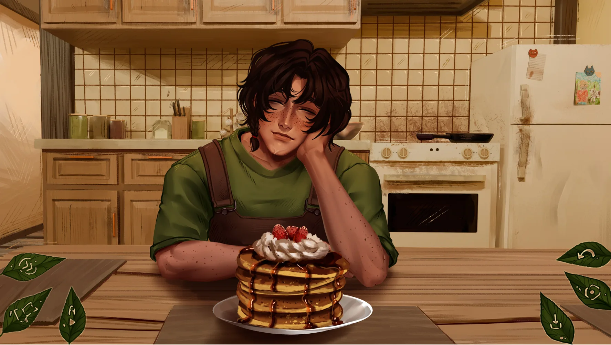
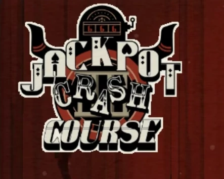

# The False Sun Browser Horror Game

The False Sun is a browser horror game site built around stories that begin with familiar places and gradually reveal that something important is wrong. The central game opens on a grandfather's farm, a setting filled with soft grass, warm light, family memory, and the expectation of safety. That comfort does not remain stable. Details drift out of place, gaps in memory become harder to ignore, and a familiar face starts to feel like part of a performance. The website places the playable game first and then supports it with screenshots, videos, original analysis, related games, and practical browser guidance.

## Play The False Sun Online

- **Official website:** [https://the-false-sun.org/](https://the-false-sun.org/)
- **Launch the game:** <a href="https://the-false-sun.org/" target="_blank" rel="noopener">Play The False Sun online</a>
- **Collection:** Browser horror, visual novels, surreal stories, character-driven games, videos, screenshots, and FAQ guides

The live website is the intended way to experience the project. This repository contains the generated static export used for deployment. The public site provides the complete header, game search, Play Game menu, deferred iframe, fullscreen and sharing controls, game-card strip, long-form content, responsive videos, and footer navigation.

## Familiar Light, Unfamiliar Meaning

The False Sun creates horror through contradiction. Daylight should make a place easier to understand, yet the brightness on the farm does not guarantee that the player is seeing the truth. Family should provide continuity, yet memory cannot fully support the story being presented. The game uses these conflicts to make ordinary details feel important. A pause in conversation, a repeated phrase, a landscape that seems too calm, or a moment of affection can become evidence that the apparent safety of the farm has been carefully arranged.

The browser page respects that slow rhythm. Its launch panel gives players a brief spoiler-light description and a clear Play Now button. The game iframe loads only after interaction, allowing the cover image and surrounding page to appear quickly. A gradual background transition connects the introduction card to the cover artwork, helping the game frame feel like one composed scene rather than an advertisement placed above an unrelated article.

## Story Images and Visual Context

Screenshots are distributed through the guide to support the subjects being discussed. Images can show the farm, character expressions, dialogue framing, or moments where warmth begins to feel staged. Every image uses a short local path and meaningful alternative text. This helps screen-reader users understand the role of the artwork and gives search engines accurate context without repeating long lists of keywords.

The site Logo uses `the-false-sun-logo.webp` across the header, favicon, game card, and social metadata. Clicking the header Logo returns to the homepage. Inner pages keep one clear H1 for the current game rather than turning the shared Logo into a second heading. These small structural decisions protect accessibility and keep page topics understandable to crawlers.

## One Shared Format, Different Games

The False Sun website includes a growing browser horror collection. All formal inner pages use shared data and the same `GamePageTemplate`, preserving the header, footer, game frame, toolbar, video placement, card strip, content width, FAQ design, and mobile behavior. New games still receive their own cover, screenshots, iframe, video links, hero description, original long-form introduction, and mature-content guidance.

The shared games array powers several discovery surfaces at once. Adding a complete entry updates the homepage cards, every inner-page card strip, the top Play Game dropdown, search results, and sitemap routes. The current game's card remains visible and receives a subtle active treatment instead of being removed. This prevents a new route from existing without the navigation needed to find it.

## Killer Chat

Killer Chat brings digital conversation and uncertainty into the collection. The player must interpret messages, character behavior, and the danger hidden behind apparent connection. Its page uses the same site structure as The False Sun while adopting its own screenshots, video references, and editorial focus. The guide avoids copying a reference page and instead explains the game's appeal through original discussion of trust, identity, online intimacy, and route choices.

This relationship between shared format and unique content is a core project rule. A new game should look native to The False Sun website without losing the specific atmosphere that made the game worth adding. The template provides consistency; the artwork and writing provide identity.

## Jackpot Crash Course

Jackpot Crash Course expands the catalog into casino spectacle and public judgment. Eddie enters a televised competition where criminal contestants are offered the possibility of a pardon. Bright lights and game-show energy make each round entertaining for an audience, while alliances, reputation, violence, and the design of the rules create pressure for the people on stage. The page includes the playable iframe, two videos, four supporting images, original long-form analysis, route guidance, browser help, and ten FAQ entries.

The game card uses the supplied Logo and appears in the same card strip as all other titles. The top Play Game menu and sitemap derive from the same data entry, reducing the chance that one navigation surface is forgotten. Its introduction follows The False Sun content framework while using a different editorial angle from versions hosted by other projects.

## Browser Compatibility and Content Guidance

Desktop or laptop fullscreen is recommended for the most comfortable game text and artwork. Mobile visitors can often play in landscape orientation, although iframe focus, audio permissions, storage behavior, and screen size vary by browser. If a frame remains black, visitors can wait for remote assets, refresh once, and check whether privacy extensions, script blockers, or managed networks are preventing the external host from loading.

Content notes help players decide whether a game fits their current mood. The collection may include psychological horror, obsessive relationships, violence, blood, gore, coercion, public humiliation, or disturbing imagery. The colorful or peaceful appearance of a game is not always a reliable guide to its themes, so each long-form page provides context without revealing every plot turn.

## Static Export and Deployment

This repository contains the static files generated by Next.js. The command `npm run build-preserve-git` moves `out/.git` to a safe location, builds in a temporary workspace, refreshes the deployment output, restores or initializes the Git repository, configures the `main` branch and GitHub remote, and copies this illustrated README from its maintained template. The manual `tmple/` folder is intentionally excluded from compilation until a route blueprint is copied into `src/app` and connected to shared site data.

Generated HTML should not be edited as the source of truth because it will be replaced during the next build. For playable games, current screenshots, videos, guides, and navigation, visit [the-false-sun.org](https://the-false-sun.org/).
